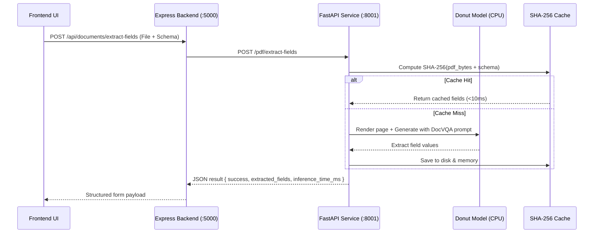
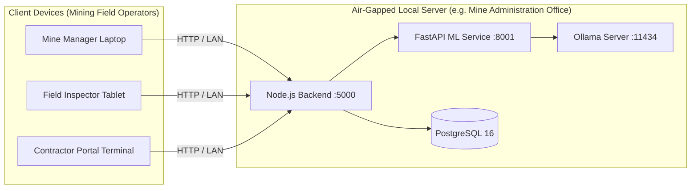

# 📚 CoalGov Project Technical Documentation & Architecture Specification

## 1. Project Background & Objective

The **Smart Mine Governance Platform (CoalGov)** is a centralized, digital e-governance system created for coal mining operations across India. Coal mining sites are regulated under strict statutory standards—including the **Mines Act, 1952**, the **Coal Mines Regulations (CMR), 2017**, and guidelines established by the **Directorate General of Mines Safety (DGMS)**, the **Coal Controller’s Organisation (CCO)**, and the **Ministry of Environment, Forest and Climate Change (MoEFCC)**.

Due to the remote locations of many mining sites and the sensitive nature of regulatory compliance and inspection data, this platform is specifically designed to operate **100% offline** without requiring external cloud AI APIs.

---

## 2. Technical Stack Breakdown

### Frontend Layer (`/Frontend`)
- **Framework**: React 18 with Vite for ultra-fast compilation and HMR.
- **Styling**: Tailwind CSS with customized color system matching government e-governance aesthetics (`brand`, `surface-card`, `border-border`, `ink-*`).
- **Streaming**: Native browser `ReadableStream` over `fetch()` with Server-Sent Events (SSE) decoder.
- **State Management**: React Context API (`AuthContext`) handling session persistence, user role switching, and automatic memory cleanup.

### Backend Application Layer (`/Backend`)
- **Runtime**: Node.js v18+ with Express.js.
- **ORM**: Prisma ORM with PostgreSQL database provider.
- **Security & RBAC**: Stateless JSON Web Token (JWT) authentication, password hashing with bcrypt, role-based route guards (`requireRole`).
- **Memory Store**: Dual storage router:
  - In-memory `MemoryStore` for temporary, non-persisted "Once Chat" sessions.
  - PostgreSQL `ChatSession` and `Message` tables for persistent sessions.
  - User-level session isolation preventing cross-role data leaks.

### Machine Learning & AI Service (`/ML`)
- **Framework**: Python 3.11/3.13 with FastAPI and Uvicorn.
- **Local Large Language Model (LLM)**: `gemma3:1b` executed through local Ollama runtime (`http://127.0.0.1:11434`).
- **Text Embeddings**: `nomic-embed-text` (768 dimensions), producing high-density semantic vector representations.
- **Vector Search**: PostgreSQL `pgvector` extension with cosine distance index (`<=>`). Includes a standalone SQLite JSON-based fallback (`rag_fallback.db`) if PostgreSQL is temporarily offline.
- **Visual Document Processor**: Hugging Face `naver-clova-ix/donut-base-finetuned-docvqa`, running via `transformers` and PyTorch CPU.
- **PDF Page Extraction**: PyMuPDF (`pymupdf`) for direct rendering of PDF bytes to PIL RGB images at 150 DPI without poppler.
- **Caching Engine**: Multi-tier SHA-256 caching (memory dict + disk JSON) storing results under `ML/cache/field_extraction/`.

---

## 3. Database Schema Overview (Prisma ORM)

```prisma
model User {
  id           String    @id @default(uuid())
  email        String    @unique
  name         String
  role         Role      @default(MINE_OFFICIAL)
  mineName     String?
  designation  String?
  chatSessions ChatSession[]
}

model Mine {
  id          String   @id @default(uuid())
  code        String   @unique
  name        String
  subsidiary  String   // ECL, BCCL, CCL, WCL, SECL, MCL, NCL
  state       String
  district    String
  operationalStatus String @default("ACTIVE")
}

model StatutoryCompliance {
  id          String             @id @default(uuid())
  mineId      String
  title       String
  category    ComplianceCategory // SAFETY, ENVIRONMENT, LABOUR, DGMS
  status      ComplianceStatus   // UNDER_REVIEW, COMPLIANT, NON_COMPLIANT, EXPIRED
  validUntil  DateTime?
}

model Inspection {
  id            String           @id @default(uuid())
  mineId        String
  inspectorId   String
  title         String
  status        InspectionStatus // SCHEDULED, IN_PROGRESS, COMPLETED
  scheduledDate DateTime
  latitude      Float?
  longitude     Float?
}

model Violation {
  id           String          @id @default(uuid())
  inspectionId String
  reporterId   String
  title        String
  severity     Severity        // LOW, MEDIUM, HIGH, CRITICAL
  status       ViolationStatus // REPORTED, ACKNOWLEDGED, RESOLVED, CLOSED
}

model ChatSession {
  id           String    @id @default(uuid())
  userId       String?
  isPersistent Boolean   @default(false)
  title        String    @default("New Chat")
  createdAt    DateTime  @default(now())
  updatedAt    DateTime  @updatedAt
  messages     Message[]
}

model Message {
  id        String      @id @default(uuid())
  sessionId String
  role      String      // user, assistant, system
  content   String
  createdAt DateTime    @default(now())
}
```

---

## 4. AI & Field Extraction Architecture

### Visual Field Extraction with Donut DocVQA
Traditional OCR pipelines fail on skewed, low-resolution, or degraded mining inspection forms because they require separate OCR bounding-box recognition followed by heuristic heuristic table classifiers.

**CoalGov utilizes Donut (Document Understanding Transformer)**:
1. **Input**: Scanned statutory PDF or image rendered to a PIL Image at 150 DPI.
2. **Encoder**: Swin Transformer maps raw pixel values directly into visual tokens.
3. **Decoder**: BART autoregressive language model conditions on visual features and generates structured values.
4. **Prompt Format**:
   ```text
   <s_docvqa><s_question>What is the {field_name}?</s_question><s_answer>
   ```
5. **Output**: Parsed answer string extracted directly from `<s_answer>...</s_answer>`.



---

## 5. Security & Session Lifecycle Management

### Strict Role & User Isolation
To ensure strict privacy between external contractors, field inspectors, and internal corporate officers:
- All chat sessions in memory (`MemoryStore`) and database (`prisma.chatSession`) are tagged with the requester's `userId`.
- When fetching sessions (`GET /api/sessions`), the backend strictly queries by `userId`. Users can never see another user's session list or message history.

### Logout Session Wiping
- Temporary "Once Chat" sessions are stored strictly in-memory during active work.
- When an operator logs out or switches accounts:
  1. The client clears all in-memory React state and localStorage cache.
  2. The client fires `POST /api/sessions/clear` with the user's authorization header.
  3. The backend immediately purges all temporary sessions associated with that `userId` from RAM.
  4. The subsequent user logs in with a guaranteed clean slate.

---

## 6. Air-Gapped / Offline Deployment Topology

For remote coal mining lease sites without internet connectivity, CoalGov can be deployed in **Offline LAN Server Mode**:



To connect clients to the local server, run:
```powershell
.\start-all.ps1 -OfflineServer <SERVER_LAN_IP>
```
