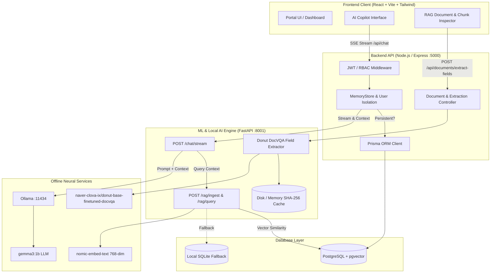

# ⛏️ CoalGov — Smart Mine Governance & AI Compliance Platform

> **An integrated, AI-powered governance, statutory compliance, and field inspection management platform engineered specifically for the Indian coal mining ecosystem.**

[](https://opensource.org/licenses/MIT)
[](https://nodejs.org/)
[](https://vitejs.dev/)
[](https://fastapi.tiangolo.com/)
[](https://ollama.ai/)
[](https://huggingface.co/naver-clova-ix/donut-base-finetuned-docvqa)

---

## 📋 Table of Contents

- [Executive Summary & Problem Statement](#-executive-summary--problem-statement)
- [System Architecture](#-system-architecture)
- [Core Features & Modules](#-core-features--modules)
  - [1. Role-Based Governance Portal](#1-role-based-governance-portal)
  - [2. Offline AI Copilot (`gemma3:1b`)](#2-offline-ai-copilot-gemma31b)
  - [3. RAG Knowledge Base & Chunk Inspector](#3-rag-knowledge-base--chunk-inspector)
  - [4. OCR-Free Visual Document Parsing (Donut DocVQA)](#4-ocr-free-visual-document-parsing-donut-docvqa)
  - [5. Dual Memory & Role-Isolated Chat Security](#5-dual-memory--role-isolated-chat-security)
- [Repository Structure](#-repository-structure)
- [Technology Stack](#-technology-stack)
- [Quick Start Guide](#-quick-start-guide)
  - [Prerequisites](#prerequisites)
  - [Single-Click Launchers (Recommended)](#single-click-launchers-recommended)
  - [Manual Step-by-Step Setup](#manual-step-by-step-setup)
- [API Reference](#-api-reference)
- [Role-Based Access Control (RBAC)](#-role-based-access-control-rbac)
- [License & Acknowledgements](#-license--acknowledgements)

---

## 🎯 Executive Summary & Problem Statement

The Indian coal mining sector spans multiple subsidiaries (CIL, ECL, BCCL, CCL, WCL, SECL, MCL, NCL, SCCL), hundreds of mine blocks, private contractors, and regulatory field offices (DGMS, CCO, MoEFCC, State PCB). 

Historically, governance activities—statutory compliance monitoring, inspection audits, violation notices, environmental clearances, and safety reports—have suffered from:
- **Fragmented Systems & Siloed Records**: Spreadsheets, paper files, and disconnected databases.
- **Compliance Blindspots**: Delayed escalation of critical safety and environmental non-compliances.
- **Contractor & Regulatory Friction**: Absence of a unified, auditable lifecycle for violations and formal counter-responses.
- **Data Privacy & Offline Constraints**: Mine sites frequently operate in remote areas without stable cloud internet access.

### The Solution: CoalGov
**CoalGov** delivers a secure, centralized e-governance platform combined with **100% offline-capable artificial intelligence**. It digitizes field inspections, manages the statutory compliance lifecycle, extracts structured form data without OCR errors, and provides an offline AI Copilot that reasons directly over uploaded statutory mining laws (Mines Act 1952, Coal Mines Regulations 2017, DGMS circulars).

---

## 🏗️ System Architecture

CoalGov is architected into three decoupled, resilient layers with local offline AI:



---

## ⚡ Core Features & Modules

### 1. Role-Based Governance Portal
- **Mine Site & Subsidiary Directory**: Operational tracking across subsidiaries (BCCL, ECL, CCL, etc.).
- **Statutory Compliance Tracker**: Monitored against regulatory categories (Safety, Environmental, DGMS, Labour) with expiration countdowns.
- **Inspections & Violations Lifecycle**: Geo-tagged field reports, formal show-cause notices, and corrective action assignment with evidence attachment.

### 2. Offline AI Copilot (`gemma3:1b`)
- Runs fully locally via Ollama with zero reliance on external APIs (OpenAI, Anthropic, etc.).
- Token-by-token streaming over Server-Sent Events (SSE).
- Answers queries regarding DGMS regulations, Mine safety guidelines, and statutory filings.

### 3. RAG Knowledge Base & Chunk Inspector
- **Document Ingestion**: Upload PDF, TXT, or Markdown documents (e.g. DGMS circulars, lease agreements).
- **Semantic Chunking & Embedding**: Chunks documents into ~500 character excerpts with overlap, embedded via `nomic-embed-text` into 768-dimensional vectors.
- **Dual Vector Storage**: High-performance PostgreSQL `pgvector` with automatic SQLite JSON fallback for instant zero-config deployments.
- **Interactive Chunk Inspector**: Search, preview, and inspect individual indexed chunks or full text directly in the UI.

### 4. OCR-Free Visual Document Parsing (Donut DocVQA)
- **Model**: `naver-clova-ix/donut-base-finetuned-docvqa` (~200M parameters).
- **OCR-Free Visual Attention**: Reads document images directly via an encoder-decoder architecture, avoiding fragile OCR + bounding-box heuristics.
- **DocVQA Prompting**: Prompts structured fields via `<s_docvqa><s_question>What is the {field}?</s_question><s_answer>`.
- **Offline Snapshot**: Cached locally in `ML/models/` with `HF_HUB_OFFLINE=1` enforced; boots in **1.44s**.
- **SHA-256 Multi-Tier Caching**: Results cached by `sha256(file_bytes + field_schema)` for instantaneous (<10ms) responses on duplicate requests.

### 5. Dual Memory & Role-Isolated Chat Security
- **Dual Modes**:
  - **Persistent Mode**: Saved to PostgreSQL via Prisma ORM for future reference.
  - **Once Chat (Temporary Mode)**: Held in runtime memory and purged on command.
- **Strict Role & User Isolation**: Chats are cryptographically and logically scoped by `userId`. Contractors, Regulators, and Officers cannot view each other's sessions.
- **Automatic Logout Wiping**: Logging out immediately clears all client-side cached conversations and invokes `POST /api/sessions/clear` to erase server-side temporary memory.

---

## 📁 Repository Structure

```text
Smart-mine-governance/
├── Backend/                       # Node.js / Express API Service
│   ├── prisma/
│   │   ├── schema.prisma          # Database schema (User, Mine, Compliance, Chat, etc.)
│   │   └── migrations/            # SQL migration history
│   ├── src/
│   │   ├── config/                # Environment & database connections
│   │   ├── controllers/           # Route logic (auth, chat, compliance, document, mine)
│   │   ├── middlewares/          # JWT verification & RBAC access control
│   │   ├── routes/                # Express API routes
│   │   ├── services/              # In-memory session store & business services
│   │   ├── utils/                 # Token signing, audit logging
│   │   └── index.js               # Backend entry point (:5000)
│   └── package.json
│
├── Frontend/                      # React / Vite SPA Client
│   ├── src/
│   │   ├── components/            # UI components (Copilot, Common, Layout)
│   │   ├── context/               # AuthContext with auto-wipe on logout
│   │   ├── data/                  # Seed data & prototype mock records
│   │   ├── pages/                 # Views (AICopilot, Dashboard, Compliance, Inspections)
│   │   ├── services/              # API client, chat streaming service
│   │   └── utils/                 # Role definitions & helpers
│   ├── package.json
│   └── vite.config.js
│
├── ML/                            # Python FastAPI Local AI Service
│   ├── models/                    # Offline Hugging Face Donut model snapshots
│   ├── cache/                     # SHA-256 field extraction disk cache
│   ├── tests/                     # Automated test suites & verification scripts
│   ├── config.py                  # Service configuration & port settings (:8001)
│   ├── main.py                    # FastAPI streaming endpoints & RAG vector store
│   ├── pdf_processor.py           # Donut DocVQA visual processor & PyMuPDF renderer
│   ├── rag_fallback.db            # SQLite vector fallback database
│   ├── requirements.txt           # Python dependencies (PyTorch CPU, Transformers, etc.)
│   └── .env                       # Offline environment flags (HF_HUB_OFFLINE=1)
│
├── start-all.bat                  # Single-click Windows Batch launcher
├── start-all.ps1                  # Single-click PowerShell launcher (with offline server support)
├── stop-all.bat                   # Single-click graceful shutdown script
└── README.md                      # Project documentation
```

---

## 💻 Technology Stack

| Layer | Technologies |
|---|---|
| **Frontend** | React 18, Vite, Tailwind CSS, Lucide Icons, Fetch ReadableStream API |
| **Backend** | Node.js, Express.js, Prisma ORM, JSON Web Tokens (JWT), Multer |
| **Database** | PostgreSQL with `pgvector` extension (with automatic SQLite fallback) |
| **ML Engine** | Python 3.11/3.13, FastAPI, Uvicorn, PyMuPDF (fitz), Pillow, NumPy |
| **Local LLM & RAG** | Ollama, `gemma3:1b` (chat), `nomic-embed-text` (embeddings) |
| **Document Vision** | Hugging Face `transformers`, `naver-clova-ix/donut-base-finetuned-docvqa` |

---

## 🚀 Quick Start Guide

### Prerequisites
1. **Node.js** v18 or higher: [Download Node.js](https://nodejs.org/)
2. **Python** 3.11 or higher: [Download Python](https://www.python.org/)
3. **Ollama**: [Download Ollama](https://ollama.ai/)
   - Pull the required local models:
     ```bash
     ollama pull gemma3:1b
     ollama pull nomic-embed-text
     ```

---

### Single-Click Launchers (Recommended)

#### Option A: Windows Batch (`.bat`)
Double-click `start-all.bat` or run:
```cmd
start-all.bat
```
*Checks Ollama, spins up PostgreSQL, ML service (8001), Backend (5000), Frontend (5173), and opens `http://localhost:5173/copilot`.*

#### Option B: Linux / macOS (`.sh`)
```bash
chmod +x start-all.sh
./start-all.sh
```

#### Option C: PowerShell (`.ps1`)
```powershell
.\start-all.ps1
```
*Supports pointing to a remote offline LAN server with `.\start-all.ps1 -OfflineServer 192.168.1.100`.*

#### Stopping Services
Double-click `stop-all.bat` (on Windows) or press `Ctrl+C` (in `start-all.sh`) to gracefully terminate all services.

---

### Database Setup Options

CoalGov includes automatic database management with multiple options:

#### 1. Zero-Config Embedded PostgreSQL (Default)
When you start the Backend (`npm start` or `npm run dev`), CoalGov will **automatically** initialize a local PostgreSQL instance on port `5432`, create `coalgov_db`, push the Prisma schema, and seed initial mock data and cryptographic audit trails. No manual installation required!

#### 2. Docker Compose (Universal)
If you prefer running standard PostgreSQL via Docker:
```bash
docker compose up -d postgres
```

#### 3. Manual Database Bootstrap & Seeding
At any time, you can initialize or re-seed the database:
```bash
# From project root
npm run db:setup

# Or inside Backend/
cd Backend
npm run db:setup
```

---

### Manual Step-by-Step Setup

#### 1. Setup Node.js Backend & Database
```bash
cd Backend
cp .env.example .env
npm install
npm run db:setup
npm run dev
```

#### 2. Setup React Frontend
```bash
cd Frontend
cp .env.example .env
npm install
npm run dev
```
*Frontend runs on `http://localhost:5173`.*

#### 3. Setup ML Service (Optional for Offline AI Copilot)
```bash
cd ML
python -m venv venv
# On Windows:
.\venv\Scripts\activate
# On Linux/macOS:
source venv/bin/activate

# Install PyTorch CPU and dependencies
pip install torch --index-url https://download.pytorch.org/whl/cpu
pip install -r requirements.txt

# Start ML service
python -m uvicorn main:app --host 0.0.0.0 --port 8001
```

---

### 🔑 Default Demo Accounts & Credentials

All default accounts use password: **`password123`**

| Portal / Role | Email / Username | Department / ID | Description |
|---|---|---|---|
| **Corporate Admin** | `system@coalgov.in` (`system`) | `system` | Full administrative oversight across all mines |
| **Safety & Rescue** | `safety_rescue@coalgov.in` (`safety`) | `safety_rescue` | DGMS statutory compliance, hazard flags, audit logs |
| **Mine Manager (Production)** | `production@coalgov.in` (`production`) | `production` | Mine operational management & response actions |
| **Contractor Portal** | `contractor@minegov.ai` (`contractor`) | `C-101` (Apex Logistics) | Corrective action responses & daily reports |
| **Regulator (DGMS/CCO)** | `regulator@minegov.ai` (`regulator`) | DGMS Inspectorate | Regulatory inspection notices & closure audits |

---

## 📡 API Reference

### AI Copilot & Chat Routes (`Backend :5000`)
| Method | Endpoint | Description |
|---|---|---|
| `POST` | `/api/chat` | Proxies token streaming from ML engine via SSE |
| `GET` | `/api/sessions` | Lists user's isolated chat sessions |
| `POST` | `/api/sessions` | Creates a new persistent or temporary chat session |
| `POST` | `/api/sessions/clear` | Wipes all temporary in-memory sessions for current user |
| `GET` | `/api/sessions/:id/messages` | Gets message history for a specific session |
| `DELETE` | `/api/sessions/:id` | Deletes a chat session |

### RAG & Document Processing (`ML :8001`)
| Method | Endpoint | Description |
|---|---|---|
| `POST` | `/chat/stream` | Direct SSE token stream from `gemma3:1b` |
| `POST` | `/rag/ingest` | Chunks, embeds, and indexes document files/text |
| `POST` | `/rag/query` | Vector cosine similarity query returning top-k chunks |
| `GET` | `/rag/documents` | Lists indexed document sources |
| `GET` | `/rag/documents/:id/chunks` | Returns full chunks and content for a document |
| `DELETE` | `/rag/documents/:id` | Purges document and embeddings from vector index |
| `POST` | `/pdf/extract-fields` | Offline Donut DocVQA visual structured field extraction |

---

## 🔐 Role-Based Access Control (RBAC)

The system enforces role boundaries across both UI and API:

| Role | Permissions & Scope |
|---|---|
| **Corporate Admin** | Full organizational oversight, subsidiary compliance audit, user administration |
| **Mine Manager** | Operational management of assigned mine site, corrective action verification |
| **Safety Officer** | DGMS statutory compliance filing, hazard logs, incident response |
| **Field Inspector** | Geo-tagged inspection logs, violation reporting, show-cause notices |
| **Contractor** | View assigned corrective actions, submit formal justification & evidence |
| **Regulator (DGMS/CCO)** | Independent inspection auditing, violation verification, closure approvals |

---

## 📄 License & Acknowledgements

- **License**: Released under the [MIT License](LICENSE).
- **DGMS Compliance**: Modeled according to the Coal Mines Regulations (CMR) 2017 and Mines Act 1952.
- **Models**:
  - `gemma3:1b` by Google DeepMind (via Ollama).
  - `nomic-embed-text` by Nomic AI.
  - `donut-base-finetuned-docvqa` by Naver Clova AI.
